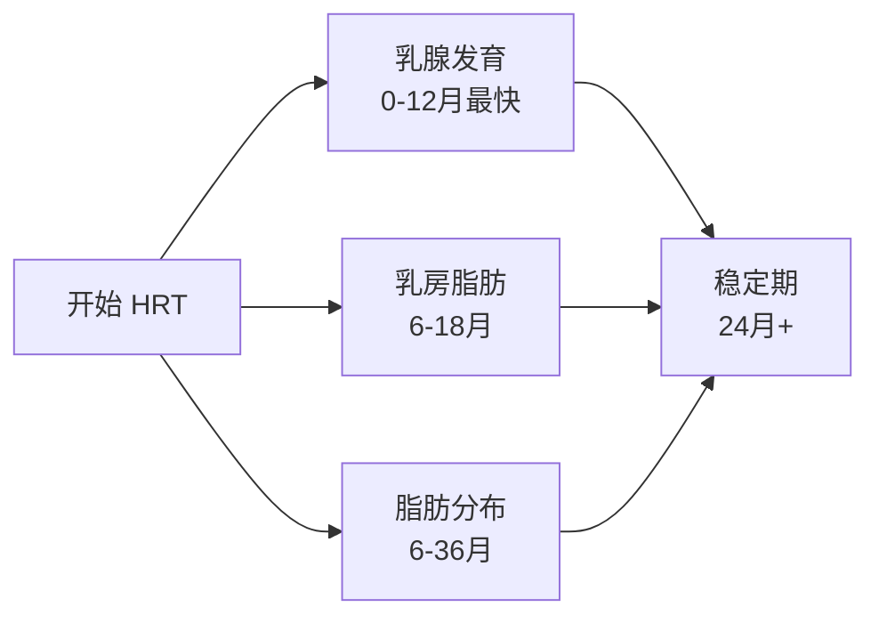

## 本节内容

HRT 的身体变化涉及三个主要系统：

| 系统 | 发育速度 | 关键因素 |
|------|----------|----------|
| **乳腺** | 最快（3-12 月） | 雌激素受体密度最高 |
| **乳房脂肪** | 中等（6-18 月） | 跟随乳腺发育 |
| **全身脂肪分布** | 最慢（6-36 月） | 臀部优先、腹部最后 |

## 三个系统的发育对比

## 关键时间线

### 快速变化（0-6 月）

- 乳头敏感（1-2 周）
- 皮肤变软（2-4 周）
- 乳腺萌芽（3-6 周）
- 乳房开始膨胀（6-12 周）

### 中期变化（6-18 月）

- 乳腺快速增生
- 乳房明显增大
- 臀部脂肪堆积
- 腹部脂肪开始减少

### 长期变化（18-36 月）

- 乳腺发育放缓
- 脂肪分布稳定
- 身体轮廓女性化完成

## 章节导航

- [乳房发育时间线](breast-timeline/) — 详细的发育阶段和案例
- [脂肪分布变化](fat-redistribution/) — 臀部、大腿、腹部的变化
- [综合时间线](integrated-timeline/) — 乳腺、乳房、脂肪的联动发育
- [骨骼发育与雌激素](bone-development/) — 骨骼闭合时间与 HRT 影响
- [Weight Cycling 理论详解](weight-cycling/) — 体重循环的起源、机制与争议

## ⚠️ 重要提醒


**发育时间因人而异**

- 社区案例显示发育可持续 **8 年以上**
- 基因决定潜力，激素决定速度
- 不要因为初期效果不明显而放弃

